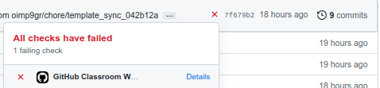
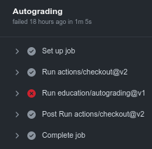
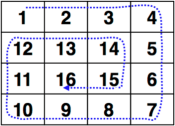

# Лабораторная работа 3

    Сдать до 07.11 включительно.
    За каждую неделю опоздания количество баллов за задание умножается на 0.7.
    Количество баллов за каждое задание сданное на неделю раньше умножается на 1.1.

    Бонусные задания не обязательны к выполнению. Коэффициенты домножения на них
    не распространяются. Т.е. их можно сдавать после дедлайна без потери баллов.
    
    Во всех задачах матрицы должны задаваться вектором векторов.
    Длины строк матрицы одинаковы, если не сказано обратное.
    Имя функции и тип возвращаемого значения должны соответствовать примерам.
    Примеры к заданиям являются только иллюстрацией и не всегда являются рабочим кодом.

    Если какой-то из аргументов вам нужно изменить в функции или передаваемое значение
    внушительного размера, не забывайте передавать его по ссылке. 

    Не забывайте добавлять const к аргументу, если не собираетесь его изменять в функции.
    Иначе может возникать ошибка такого плана:
    error: binding reference of type ‘Point&’ to ‘const Point’ discards qualifiers


```
Предположим, что вы хотите отправить решение к задаче а1.
Для этого вам нужно открыть папку solutions, найти файл, который называется a1.h,
и вставить туда ваше решение. 
#pragma once удалять не надо!
```
```
Нажав на крестик вы сможете увидеть какие тесты ваша программа прошла, а какие нет.
```

### Сложность А
        (1 балл за задание)

<ol>
<li>
Напишите функцию, которая принимает на вход две матрицы, заполненные целыми числами.
Функция должна возвращать true, если матрицы равны 
и false, если нет.

```c++
    AreMatricesIdentical( {{1, 2}, {1, 2}}, {{1, 2}, {1, 2}} ); // true
    AreMatricesIdentical( {{1, 2, 3}}, {{3, 2, 1}} ); // false
    AreMatricesIdentical( {}, {{}} ); // false
```
</li>

<li>
Напишите функцию, которая принимает на вход матрицу, заполненную целыми числами.
Функция должна находить столбец с максимальной суммой элементов и возвращать сумму его элементов.

[comment]: <> (_0 &le; N &le; 10<sup>3</sup>_)

```c++
    TheGreatestColumnSum( {{1, 2}, {3, 4}} ); // 6
    TheGreatestColumnSum( {{1, 2, 3}, {3, 2, 1}} ); // 4
    TheGreatestColumnSum( {} ); // 0 
```
</li>

<li>

Напишите функцию, которая проверяет находится ли точка в прямоугольнике. Расположение точки
задаётся структурой <i>Point</i> , которая содержит целочисленные поля <i>x</i> и <i>y</i>. Прямоугольник задаётся
структурой <i>Rectangle</i>, которая содержит неотрицательные целочисленные поля <i>width</i> и <i>height</i>.
Считается, что прямоугольник имеет вершины в точках <i>(0, 0)</i> и <i>(Rectangle.width, Rectangle.height)</i>.

```c++
    isInRectangle(Point{3, 3}, Rectangle{3, 3}); // true
    isInRectangle(Point{1, 2}, Rectangle{3, 4}); // true
    isInRectangle(Point{5, 4}, Rectangle{3, 3}); // false
```

</li>


<li>
Напишите функцию, которая принимает на вход две строки. Функция должна проверять
является ли вторая строка префиксом первой. Пустая строка
является префиксом любой другой строки.

    подсказка: используйте функцию substr()

```c++
    IsPrefix( "automobile", "auto" ); // true
    IsPrefix( "automobile", "Auto" ); // false
    IsPrefix( "Every 60 seconds in Africa, a minute passes.", "Every 60" ); // true
```
</li>

<li>

Напишите функцию, которая принимает матрицу размера NxN (_1 &le; N &le; 10<sup>3</sup>_). Функция должна развернуть
матрицу на 90 градусов по часовой стрелке. Функция не должна ничего возвращать, а вместо этого должна
изменять входной массив.

```c++
    RotateMatrix( {{1, 2}, {3, 4}}; // {{3, 1},{4, 2}}
    RotateMatrix( {{1, 2, 3}, {4, 5, 6}, {7, 8, 9}} ); // {{7, 4, 1}, {8, 5, 2}, {9, 6, 3}}
    RotateMatrix( {{1}} ); // {{1}}
```

</li>

<li>
Напишите функцию AddProductToShop, которая описывает добавление нового товара на прилавок магазина.
Функция должна принимать объект структуры Shop и объект структуры Product. Структуры Shop и
Product описываются следующим образом:

```c++
    struct Product {
        string name;
        double cost;
    };    

    struct Shop {
        vector<Product>shelf_1;
        vector<Product>shelf_2;
        vector<Product>shelf_3;
        
        double calculateMeanCost();
    };
```
Функция должна добавлять товар на одну из полок в магазине _(shelf_1, shelf_2, shelf_3)_
таким образом, чтобы максимальная разница между количеством товаров на разных полках
не превышала 1. Вам также нужно реализовать метод calculateMeanCost структуры Shop,
который считает среднюю стоимость товара в магазине.

```c++
    Shop shop;
    Product cow{"cow", 100};
    Product horse{"horse", 150};
    AddProductToShop(shop, cow);
    cout << shop.calculateMeanCost(); // 100
    AddProductToShop(shop, horse);
    cout << shop.calculateMeanCost(); // 125
    size_t min_size = min(min(shop.shelf_1.size(), shop.shelf_2.size()), shop.shelf_3.size());
    size_t max_size = max(max(shop.shelf_1.size(), shop.shelf_2.size()), shop.shelf_3.size());
    cout << ((max_size - min_size) == 1); // 1
```
</li>

</ol>


### Бонусные задания сложности A
        (1 балл за задание)

<ol>

<li>
Напишите функцию, которая принимает на вход целое число N. Она должна возвращать
квадратную 
<a href="https://en.wikipedia.org/wiki/Symmetric_matrix">симметричную относительно главной диагонали матрицу</a>
размера N. Все числа в матрице, за исключением симметричных
элементов должны различаться.

```c++
    CreateSymmetrical(2); // {{1, 2},
                          //  {2, 3}}
    CreateSymmetrical(3); // {{1, 2, 3},
                          //  {2, 4, 5},
                          //  {3, 5, 6}}
    CreateSymmetrical(0); // {}
```
</li>

<li>
Игровое поле для игры в судоку представляет собой квадрат размером 9×9,
разделённый на меньшие квадраты со стороной в 3 клетки. 
Всё игровое поле должно заполняться цифрами от 1 до 9.
В каждой строке, в каждом столбце и в каждом малом квадрате 3х3 каждая цифра должна 
встречаться ровно 1 раз. 
В данном задании вам дан уже заполненный цифрами малый квадрат 3х3. Ваша задача состоит
в том, чтобы проверить заполнен ли этот квадрат правильно, т.е. содержит цифры
от 1 до 9 только один раз.

```c++
    IsCorrectSudokuSquare({{1, 3, 2}, {9, 7, 8}, {4, 5, 6}}); // true
    IsCorrectSudokuSquare({{1, 1, 3}, {6, 5, 4}, {8, 7, 9}}); // false
    IsCorrectSudokuSquare({{0, 1, 2}, {6, 4, 5}, {9, 8, 7}}); // false
```
</li>

<li>
Напишите функцию, которая принимает матрицу размера M x N заполненную различными числами.
Счастливым числом считается такой элемент матрицы, который является минимальным элементом 
в его строке и максимальным в его столбце.
Верните вектор заполненный в любом порядке всеми счастливыми числами матрицы.  

```c++
    LuckyNumbers( {{3, 7, 8}, {9, 11, 13}, {15, 16, 17}} ); // {15}
    LuckyNumbers( {{1, 10, 4, 2}, {9, 3, 8, 7}, {15, 16, 17, 12}} ); // {12}
    LuckyNumbers( {{3, 6}, {7, 1}, {5, 2}, {4, 8}} ); // {}
```
</li>


</ol>


### Сложность B
        (1.5 балла за задание)
        (5 задач)

<ol>

<li>
Напишите функцию, которая на вход принимает два отсортированных по неубыванию массива.
Функция должна сливать их в один отсортированный по неубыванию результирующий массив и
возвращать его. Длина результирующего массива должна равняться сумме длин массивов
аргументов.

    Для сливания массивов используйте следующий алгоритм: 
    На каждом шаге мы берём меньший из двух первых элементов подмассивов и записываем его
    в результирующий массив. Счётчики номеров элементов результирующего массива и 
    подмассива, из которого был взят элемент, увеличиваем на 1.
    Когда один из подмассивов закончился, мы добавляем все оставшиеся элементы второго
    подмассива в результирующий массив.

```c++
    MergeSortedArrays({1, 6, 9}, {-3, 4, 12}); // {-3, 1, 4, 6, 9, 12}
    MergeSortedArrays({-5, 4}, {0}); // {-5, 0, 4}
    MergeSortedArrays({}, {}); // {}
```
</li>


<li>
В игре крестики-нолики игроки по очереди ставят на свободные клетки поля 3×3 знаки
(один всегда крестики, другой всегда нолики). Первый, выстроивший в ряд 3 своих
фигуры по вертикали, горизонтали или диагонали, выигрывает.
В данном задании вам дана уже заполненная конфигурация игрового поля (матрица символов),
где 'X' - крестик, 'O' - нолик, '.' - незаполненная клетка.
Ваша задача состоит в том, чтобы определить результат игры.
Если победили крестики, то верните "X", если нолики,
то "O", если результатом игры является ничья, то "Tie".

```c++
    TicTacToeResult({
                        {'X', 'O', '.'},
                        {'.', 'X', 'O'},
                        {'.', '.', 'X'}
                    }); // "X"
    TicTacToeResult({
                        {'X', 'O', 'X'},
                        {'O', 'X', '.'},
                        {'X', '.', 'O'}
                    }); // "X"  
    TicTacToeResult({
                        {'X', 'X', 'O'},
                        {'O', 'O', 'X'},
                        {'X', 'X', 'O'}
                    }); // "Tie"
```
</li>


<li>

Напишите функцию, которая принимает целое неотрицательное число в качестве аргумента,
и возвращает целое число - его мультипликативную стойкость. Мультипликативная стойкость 
характеризует количество раз, которое нужно заменить число на произведение его цифр
пока в числе не останется только одна цифра.
    
    1) 2718 -> 2 * 7 * 1 * 8 = 112 (3 цифры)
    2) 112 -> 1 * 1 * 2 = 2 (1 цифра)
    таким образом мультипликативная стойкость числа 2718 равняется 2

Решите это задание с использованием рекурсии.

```c++
    MultiplicativePersistence(2718); // 2
    MultiplicativePersistence(5); // 0
    MultiplicativePersistence(277777788888899); // 11
```

</li>

</ol>

### Бонусные задания сложности B
        (1.5 баллов за задание)

<ol>


<li>
Напишите функцию, которая принимает целое число N &ge; 1 и возвращает двумерный массив,
содержащий <a href="https://en.wikipedia.org/wiki/Pascal%27s_triangle">треугольник Паскаля</a> размером N.
В качестве типа чисел в матрице используйте int. 

```c++
PascalTriangle(1)->{{1}}
PascalTriangle(5)->{{1}, {1, 1}, {1, 2, 1}, {1, 3, 3, 1}, {1, 4, 6, 4, 1}}
```
</li>

<li>
Вам дан массив стоимостей prices размера N какой-то акции за промежуток времени, где prices[i]
стоимость этой акции в i-ый день. Вам нужно максимизировать прибыль выбрав один день
для покупки акции и другой день в будущем для продажи. Напишите функцию, которая принимает на
вход массив и возвращает число - максимальную прибыль, которую можно получить с 
этой сделки. Верните 0, если вы не можете получить прибыль в этой сделке. (1 &le; N &le; 10<sup>5</sup>)

```c++
MaxProfit({7, 1, 5, 3, 6, 4}) -> 5
MaxProfit({10, 5, 3, 0}) -> 0
```
</li>

</ol>


### Сложность C
        (2 балла за задание)
        (2 задачи)

<ol>

<li>
Напишите функцию, которая принимает на вход неупорядоченный массив и сортирует его при помощи
алгоритма сортировки слиянием. Функция не должна ничего возвращать, а вместо этого должна
изменять входной массив.

```c++
    MergeSort({1, 9, 0, -5}); // {-5, 0, 1, 9}
    MergeSort({}); // {}
```
</li>


<li>
Напишите функцию, которая на вход принимает вектор целых чисел. Функция должна
обрабатывать вектор и возвращать статистику по нему в виде структуры с названием Stats. 
Структура Stats должна содержать следующие поля:
<ul>
    <li>size - объём выборки - количество элементов в массиве;</li>
    <li>range - размах выборки - разность между наибольшим и наименьшим элементами;</li>
    <li>mean - арифметическое среднее - частное от деления суммы элементов на их количество;</li>
    <li>median - медиана - элемент, который оказался посередине после сортировки. Если
количество элементов чётное, то медина - это среднее арифметическое двух элементов, оказавшихся
посередине;</li>
    <li>mode - мода - наиболее часто встречающийся элемент.</li>
</ul>

    Использовать встроенные функции языка запрещено.

```c++
GetStats( {7, 2, 3, 4, 15, -4, -4, 10} ); // Stats{size = 8,
                                          //        range = 19,
                                          //        mean = 4.125,
                                          //        median = 3.5,
                                          //        mode = -4};
```
</li>

</ol>

### Бонусные задания сложности C
        (2 балла за задание)

<ol>
<li>
Напишите функцию, которая принимает два целых числа M &ge; 1 и N &ge; 1 и возвращает матрицу размером MxN заполненную числами от 1 до
M * N по спирали по часовой стрелке начиная с позиции (0, 0).

<div align="center">



</div>

```c++
    CreateSpiral(2, 3) -> {{1, 2, 3}, {6, 5, 4}} // 2 строки 3 столбца
    CreateSpiral(3, 3) -> {{1, 2, 3}, {8, 9, 4}, {7, 6, 5}} // 3 строки 3 столбца
```


</li>

</ol>